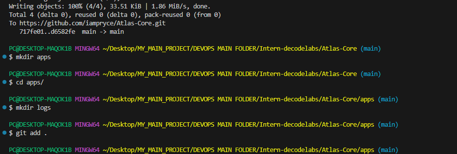
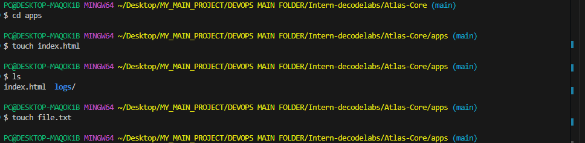
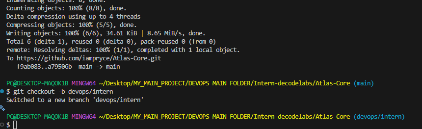
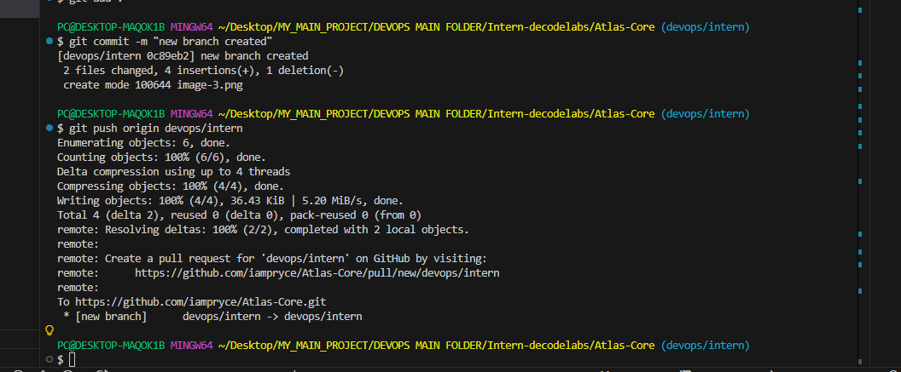
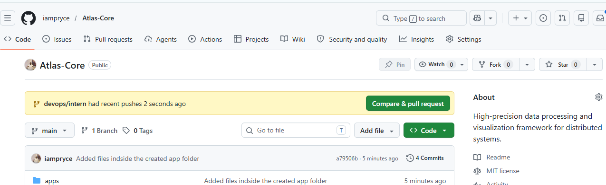
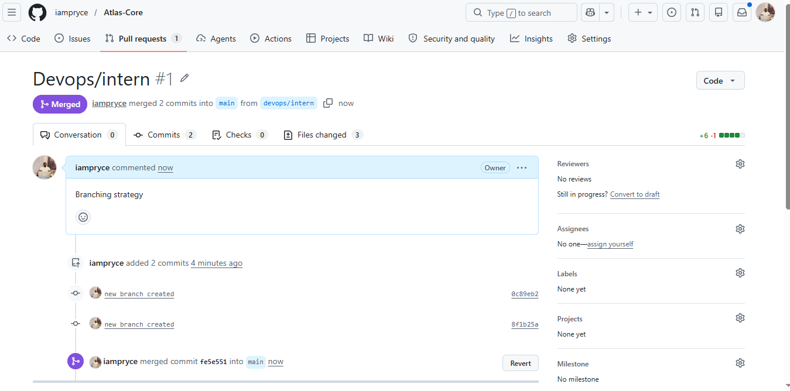

# Project: Atlas-Core

High-precision data processing and visualization framework for distributed systems.

# Installation

```bash
git clone https://github.com/atlas/core.git
cd core
npm install
```

# Usage

```bash
npm start
```

# Access the dashboard at http://localhost:3000


# Setups

# Git user tracking

 

# Added Project app folders


# Added Files



# Branching 




# Branch Pull Requests



